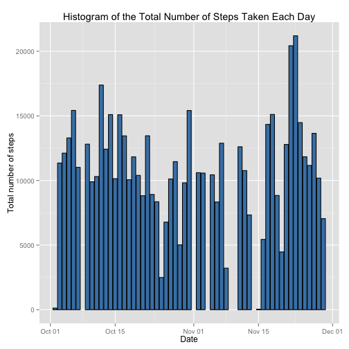

Reproducible Research: Peer Assessment 1
==========================================

### Basic settings

```r
echo = TRUE  # Always make code visible
options(scipen = 1)  # Turn off scientific notations for numbers
```

## Loading and preprocessing the data
1.Load the data (i.e. read.csv())
2.Process/transform the data (if necessary) into a format suitable 
  for your analysis

```r
unzip("activity.zip")
activityData <- read.csv("activity.csv", colClasses = c("integer", "Date", "factor"))
head(activityData)
```

```
##   steps       date interval
## 1    NA 2012-10-01        0
## 2    NA 2012-10-01        5
## 3    NA 2012-10-01       10
## 4    NA 2012-10-01       15
## 5    NA 2012-10-01       20
## 6    NA 2012-10-01       25
```

## What is mean total number of steps taken per day?
For this part of the assignment, you can ignore the missing values in the dataset.
1.Calculate the total number of steps taken per day

```r
steps_per_day <- aggregate(steps~date, data= activityData,sum)
head(steps_per_day)
```

```
##         date steps
## 1 2012-10-02   126
## 2 2012-10-03 11352
## 3 2012-10-04 12116
## 4 2012-10-05 13294
## 5 2012-10-06 15420
## 6 2012-10-07 11015
```
2.Make a histogram of the total number of steps taken each day
(If you want y to represent values in the data, use stat="identity")

```r
library(ggplot2)
g <- ggplot(steps_per_day,aes(date,steps))
g + 
  geom_histogram(stat="identity",colour = "black",fill="steelblue")+
  labs(title ="Histogram of the Total Number of Steps Taken Each Day",
       x = "Date", y = "Total number of steps")
```

 

3.Calculate and report the mean and median of the total number of steps 
taken per day

```r
steps_mean <-mean(steps_per_day$steps,na.rm = T)
steps_median<-median(steps_per_day$steps,na.rm = T)
```
The mean is 10766.1886792, and median is 10765

## What is the average daily activity pattern?
1.Make a time series plot (i.e. type = "l") of the 5-minute interval (x-axis) 
and the average number of steps taken, averaged across all days (y-axis)

```r
steps_per_interval <- aggregate(activityData$steps,
                                by = list(interval = activityData$interval),
                                FUN = "mean", na.rm =TRUE)
head(steps_per_interval)
```

```
##   interval          x
## 1        0  1.7169811
## 2       10  0.1320755
## 3      100  0.3207547
## 4     1000 40.5660377
## 5     1005 26.9811321
## 6     1010 42.4150943
```

```r
colnames(steps_per_interval) <- c("interval1", "steps1")
head(steps_per_interval)
```

```
##   interval1     steps1
## 1         0  1.7169811
## 2        10  0.1320755
## 3       100  0.3207547
## 4      1000 40.5660377
## 5      1005 26.9811321
## 6      1010 42.4150943
```
In order to plot, we transform variable interval1 from factor to numeric

```r
steps_per_interval$interval1 <- as.numeric(levels(steps_per_interval$interval1))
g <- ggplot(steps_per_interval,aes(interval1, steps1))
g + geom_line(color="steelblue", size=1) +
     labs(title="Average Daily Activity Pattern", x="Interval", y="Number of steps")
```

 

2.Which 5-minute interval, on average across all the days in the dataset, 
contains the maximum number of steps?
In order to plot, we transform variable interval1 from factor to numeric

```r
max <- steps_per_interval[which.max(  
                steps_per_interval$steps1),]
```
835th interval contains the maximum number of steps 
which is 206.1698113

## Imputing missing values
1.Calculate and report the total number of missing values in the dataset 
(i.e. the total number of rows with NAs)

```r
sumNa <- sum(is.na(activityData))
```
The total number of missing values in the dataset is 2304

2.Devise a strategy for filling in all of the missing values in the dataset. 
The strategy does not need to be sophisticated. For example, you could use the 
mean/median for that day, or the mean for that 5-minute interval, etc.

I choose to fill the missing values with mean value at that 5-minute interval.

```r
newData <- activityData
for (i in 1:nrow(newData)) {
    if (is.na(newData$steps[i])) {
        newData$steps[i] <- steps_per_interval[which(newData$interval[i] == steps_per_interval$interval1), ]$steps1
    }
}
head(newData)
```

```
##       steps       date interval
## 1 1.7169811 2012-10-01        0
## 2 0.3396226 2012-10-01        5
## 3 0.1320755 2012-10-01       10
## 4 0.1509434 2012-10-01       15
## 5 0.0754717 2012-10-01       20
## 6 2.0943396 2012-10-01       25
```
We can check if there is any missing value now

```r
sum(is.na(newData))
```

```
## [1] 0
```

3.Create a new dataset that is equal to the original dataset but with the 
missing data filled in.

```r
head(newData)
```

```
##       steps       date interval
## 1 1.7169811 2012-10-01        0
## 2 0.3396226 2012-10-01        5
## 3 0.1320755 2012-10-01       10
## 4 0.1509434 2012-10-01       15
## 5 0.0754717 2012-10-01       20
## 6 2.0943396 2012-10-01       25
```

4.Make a histogram of the total number of steps taken each day

```r
newData_categorial <- aggregate(steps~date,newData,sum)
g <- ggplot(newData_categorial,aes(date,steps))
g + geom_histogram(stat = "identity", colour = "black", fill = "orange") +
    labs(title = "Histogram of Total Number of Steps Taken Each Day (no missing data)", 
         x = "Date", y = "Total number of steps")
```

 

*Calculate and report the mean and median total number of steps taken per day.

```r
newMean <- mean(newData_categorial$steps)
newMedian <-median(newData_categorial$steps)
```
Before filling NAs:  
mean:10766.1886792  
median:10765   

After filling NAs:  
mean:10766.1886792  
median:10766.1886792  

*Do these values differ from the estimates from the first part of the 
assignment?What is the impact of imputing missing data on the estimates of the total daily number of steps?
After imputing missing data,mean is the same, but median after filling is a 
little bit larger.

## Are there differences in activity patterns between weekdays and weekends?
1.Create a new factor variable in the dataset with two levels – “weekday” 
and “weekend” indicating whether a given date is a weekday or weekend day.

```r
newData$day <-weekdays(newData$date)
head(newData)
```

```
##       steps       date interval    day
## 1 1.7169811 2012-10-01        0 Monday
## 2 0.3396226 2012-10-01        5 Monday
## 3 0.1320755 2012-10-01       10 Monday
## 4 0.1509434 2012-10-01       15 Monday
## 5 0.0754717 2012-10-01       20 Monday
## 6 2.0943396 2012-10-01       25 Monday
```

```r
newData$dateType <-as.factor(newData$day)
levels(newData$dateType) <- list(weekday = c("Monday", "Tuesday",
                                             "Wednesday", 
                                             "Thursday", "Friday"),
                                 weekend = c("Saturday", "Sunday"))
levels(newData$dateType)
```

```
## [1] "weekday" "weekend"
```

2. Make a panel plot containing a time series plot (i.e. type = "l") of the 
5-minute interval (x-axis) and the average number of steps taken, averaged 
across all weekday days or weekend days (y-axis).

```r
steps_per_dateType <- aggregate(newData$steps,
                                by = list(interval = as.numeric(as.character(
                                                        newData$interval)),
                                          dateType = newData$dateType),
                                FUN = "mean")
head(steps_per_dateType)
```

```
##   interval dateType          x
## 1        0  weekday 2.25115304
## 2        5  weekday 0.44528302
## 3       10  weekday 0.17316562
## 4       15  weekday 0.19790356
## 5       20  weekday 0.09895178
## 6       25  weekday 1.59035639
```

```r
colnames(steps_per_dateType) <- c("interval2","dateType","steps2")
head(steps_per_dateType)
```

```
##   interval2 dateType     steps2
## 1         0  weekday 2.25115304
## 2         5  weekday 0.44528302
## 3        10  weekday 0.17316562
## 4        15  weekday 0.19790356
## 5        20  weekday 0.09895178
## 6        25  weekday 1.59035639
```

```r
library(lattice)
xyplot(steps_per_dateType$steps2 ~ steps_per_dateType$interval2 |  
                                         steps_per_dateType$dateType, 
       layout = c(1, 2), type = "l",
       xlab = "Interval", ylab = "Number of steps")
```

 
